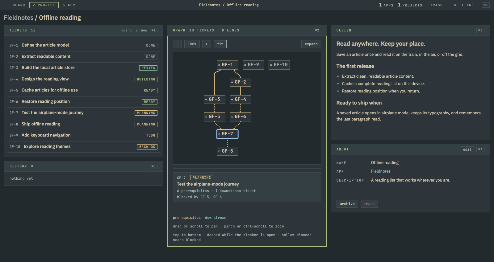
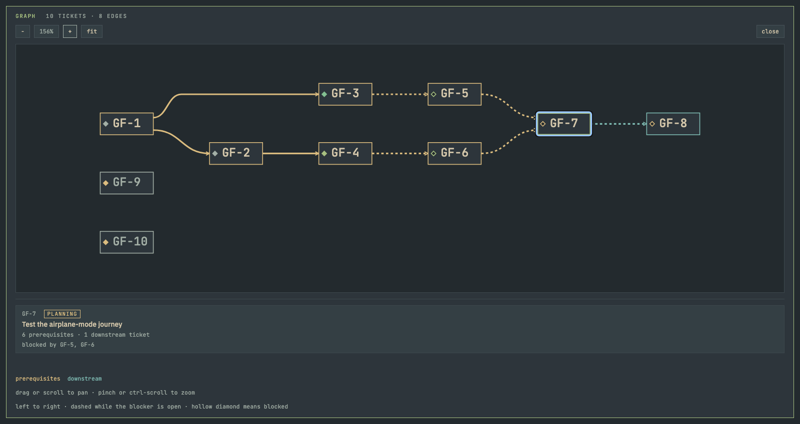
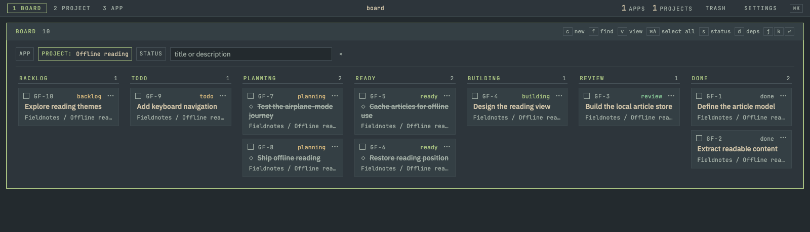

<div align="center">

# Goblin Foundry

**See what blocks shipping. Keep the decision to ship yours.**

A local-first project tracker for developers working with AI agents.
Dependency graphs, a keyboard-driven board, and a CLI that speaks JSON.

[Quick start](#quick-start) · [How it works](#how-it-works) · [Development](docs/development.md) · [Contributing](CONTRIBUTING.md)

</div>



*The project at a glance: tickets, their blocking relationships, and the plan. Screenshots use fictional demo data.*

## Why Goblin?

A list of tickets tells you what exists. Goblin shows you what can move next.

Connect tickets with blocking edges, keep the plan beside the work, and let the ready frontier tell you which approved tickets have nothing in their way. Agents can write plans and arrange dependencies. A human decides when work is ready.

- **Dependencies you can read.** Project graphs adapt to the space, connecting tickets horizontally or vertically. Dashed edges mark open blockers; hollow diamonds identify blocked tickets. Pan, zoom, or expand the graph to follow a larger project.
- **A board built for the keyboard.** Navigate tickets, open the command palette, filter by project or status, and apply atomic bulk actions. Filters live in the URL, so bookmarks become saved views.
- **Plans live with the work.** Markdown project and ticket designs, edit history, and links to implementing pull requests or commits stay together.
- **One API, two interfaces.** The React interface and `goblin` CLI share the same typed HTTP API and lifecycle rules. CLI output is JSON; refusals explain what went wrong.
- **Your machine, your database.** One Bun process serves the app over localhost. One SQLite file holds the data. No account or hosted service is required.

Goblin is an early, working tracker. Autonomous execution, controller leases, and multi-user hosting are future work; the tracker and its human approval boundary are implemented today.

## Follow the dependencies



Focus a ticket to trace its prerequisites and downstream work. Open blockers stay dashed; completed dependencies become solid.



The same work on the board, with blocked tickets marked directly on their cards.

## Quick start

Install [Bun](https://bun.sh), then:

```sh
git clone https://github.com/itsRoze/goblin-foundry.git
cd goblin-foundry
bun install --frozen-lockfile
bun run build
bun api/src/server.ts
```

Open **http://127.0.0.1:4747**. Create an app, add a project, and start planning tickets. The database is created automatically at `~/.goblin-foundry/foundry.db`.

The server binds to localhost and has no authentication. It is intended for personal use on your machine.

To install the CLI, open another terminal in the checkout:

```sh
(cd cli && bun link)
goblin --help
```

On macOS with Homebrew Bun at `/opt/homebrew/bin/bun`, `goblin service install` builds the GUI and installs a background LaunchAgent that starts at login. See the [service and development guide](docs/development.md#run).

## How it works

```text
backlog → todo → planning → ready → building → review → done
                  agent      ↑
                         human approval
```

This is the usual forward path; the lifecycle also supports shelving, cancellation, reopening, and closing completed work.

Approval requires an app and a ticket design, unless the ticket is marked simple. **Blocked is a derived condition, not another status.** A ready ticket only appears in the frontier when its open blockers are gone. Dependency cycles are rejected.

An agent can prepare a plan through the same CLI you use:

```sh
# Use an existing project ID from `goblin project list`.
goblin ticket create --actor agent --project 1 --title 'Parse an RSS feed'
goblin ticket design set --actor agent GF-1 @plan.md
goblin ticket create --actor agent --project 1 --title 'Render the reading list'
goblin dependency add --actor agent --blocker GF-1 --blocked GF-2
goblin frontier --actor agent
```

Replace the example keys with the returned keys. An agent's reach ends at planning: it cannot approve its own work or advance the lifecycle. Actor identity is a workflow convention enforced by the API, not an authentication system.

## Small runtime, explicit rules

| Piece | Responsibility |
| --- | --- |
| [`shared/`](shared) | Zod schemas, lifecycle transitions, and shared domain rules |
| [`api/`](api) | Hono HTTP API, Drizzle queries, and the SQLite boundary |
| [`web/`](web) | React UI, Vite build, dependency graph, and keyboard navigation |
| [`cli/`](cli) | JSON client, database backups, and macOS service management |
| [`e2e/`](e2e) | Browser coverage, including touch and responsive layouts |

The database driver has one entry point. Bulk mutations commit together or roll back together. The visual system is documented and checked by lint rules. These choices have [architecture decision records](docs/adr), and the product vocabulary has a [domain glossary](CONTEXT.md).

## Develop

```sh
bun dev                # watch the GUI and API
bun test               # unit and in-process API/CLI tests
bun run typecheck
bun run lint
bunx playwright install chromium webkit
bun run test:e2e        # built app, isolated temporary database
```

If port 4747 is occupied, use `GF_PORT=4748 bun dev`. Set `GF_DB_PATH` to keep a development database separate from your everyday tracker.

Read the [development and CLI reference](docs/development.md), [contribution guide](CONTRIBUTING.md), and [design system](design/DESIGN.md).

## License

[MIT](LICENSE). Third-party dependencies and bundled tools retain their own licenses; see [third-party notices](THIRD_PARTY_NOTICES.md).
